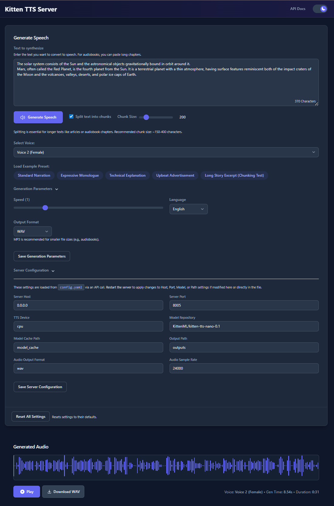
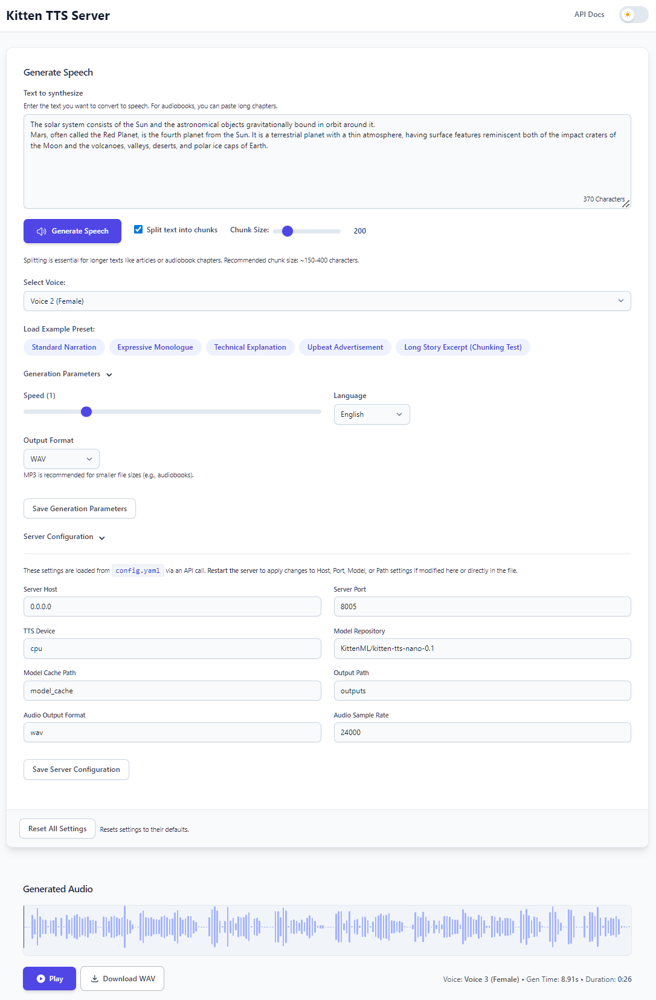

# Kitten TTS Server: Lightweight TTS with API and Web UI

**Self-host the ultra-lightweight [KittenTTS model](https://github.com/KittenML/KittenTTS) with this enhanced API server. Features an intuitive Web UI, a flexible API, and large-text processing for audiobooks. Optional GPU acceleration is available.**

This server provides a robust, user-friendly, and powerful interface for the kitten-tts engine, an open-source, realistic text-to-speech model with just 15 million parameters. This project enhances the original model by adding a full-featured server, an easy-to-use UI, and optimized CPU-first inference, with optional GPU support via extras.

[](https://github.com/devnen/Kitten-TTS-Server)
[](LICENSE)
[](https://www.python.org/downloads/)
[](https://fastapi.tiangolo.com/)
[](https://github.com/KittenML/KittenTTS)
[](#)
[](https://platform.openai.com/docs/api-reference)

<div align="center">
  
  
</div>

---

## 🗣️ Overview: Enhanced KittenTTS Generation

The [KittenTTS model by KittenML](https://github.com/KittenML/KittenTTS) provides a foundation for generating high-quality speech from a model smaller than 25MB. This project elevates that foundation into a production-ready service by providing a robust [FastAPI](https://fastapi.tiangolo.com/) server that makes KittenTTS significantly easier to use, more powerful, and drastically faster.

We solve the complexity of setting up and running the model by offering:

*   A **modern Web UI** for easy experimentation, preset loading, and speed adjustment.
*   Optional **GPU Acceleration** for NVIDIA GPUs via extras (see installation).
*   **Large Text Handling & Audiobook Generation:** Intelligently splits long texts into manageable chunks, processes them sequentially, and seamlessly concatenates the audio. Perfect for creating complete audiobooks.
*   **A flexible, dual-API system** including a simple endpoint and an OpenAI-compatible endpoint for easy integration.
*   **Built-in Voices:** A fixed list of 8 ready-to-use voices for consistent and reliable output.
*   **Cross-platform support** for Windows and Linux, with clear setup instructions.
*   Simple local install (no Docker files in this repo).

## 🔥 Optional GPU Acceleration

If you have an NVIDIA GPU and want acceleration, install the optional GPU extras described below.

## 🔄 Alternative to Piper TTS

The [KittenTTS model](https://github.com/KittenML/KittenTTS) serves as an excellent alternative to [Piper TTS](https://github.com/rhasspy/piper) for fast generation on limited compute and edge devices like Raspberry Pi 5.

**KittenTTS Model Advantages:**
- **Extreme Efficiency**: Just 15 million parameters and under 25MB, significantly smaller than most Piper models
- **Universal Compatibility**: CPU-optimized to run without GPU on any device and "works literally everywhere"
- **Real-time Performance**: Optimized for real-time speech synthesis even on resource-constrained hardware

**This Server Project's Enhancement:**
While KittenTTS provides the ultra-lightweight foundation, this server transforms it into a production-ready Piper replacement by adding GPU acceleration (unavailable in the base model), modern REST/OpenAI APIs, audiobook processing capabilities, and an intuitive web interface—all while maintaining the model's edge device compatibility.

Perfect for users seeking Piper's offline capabilities with better performance on limited hardware and modern server infrastructure.

## ✨ Key Features of This Server

*   **🚀 Ultra-Lightweight Model:** Powered by the `KittenTTS` ONNX model, which is under 25MB.
*   ⚡ **Optional GPU Acceleration:** Enable NVIDIA (CUDA) support via `onnxruntime-gpu` by installing the GPU extra.
*   **📚 Large Text & Audiobook Generation:**
    *   Automatically handles long texts by intelligently splitting them based on sentence boundaries.
    *   Processes each chunk individually and seamlessly concatenates the resulting audio.
    *   **Ideal for audiobooks** - paste entire books and get professional-quality audio.
*   **🖥️ Modern Web Interface:**
    *   Intuitive UI for text input, voice selection, and parameter adjustment.
    *   Real-time waveform visualization of generated audio.
*   **🎤 8 Built-in Voices:**
    *   Utilizes the 8 built-in voices from the KittenTTS model (4 male, 4 female).
    *   Easily selectable via a UI dropdown menu.
*   **⚙️ Dual API Endpoints:**
    *   A primary `/tts` endpoint offering full control over all generation parameters.
    *   An OpenAI-compatible `/v1/audio/speech` endpoint for seamless integration into existing workflows.
*   **🔧 Easy Configuration:**
*   All settings are managed through a single `configs/config.yaml` file.
    *   The server automatically creates a default config on the first run.
*   **💾 UI State Persistence:** The web interface remembers your last-used text, voice, and settings to streamline your workflow.
*   

---

## 🔩 System Prerequisites

*   **Operating System:** Windows 10/11 (64-bit) or Linux (Debian/Ubuntu recommended).
*   **Python:** Version 3.9
*   **Git:** For cloning the repository.
*   **eSpeak NG:** This is a **required** dependency for text phonemization.
    *   **Windows:** See installation guide below.
    *   **Linux:** `sudo apt install espeak-ng`
*   **(For GPU Acceleration, optional):**
    *   An **NVIDIA GPU** with CUDA support.
*   **(For Linux Only):**
    *   `libsndfile1`: Audio library needed by `soundfile`. Install via `sudo apt install libsndfile1`.
    *   `ffmpeg`: For robust audio operations. Install via `sudo apt install ffmpeg`.
*   **UV** For ease of installation and package management. [uv](https://github.com/astral-sh/uv) can be installed using (`pip install uv` or `curl -LsSf https://astral.sh/uv/install.sh | sh`)

## 💻 Running the Server

**Important: First-Run Model Download**
The first time you start the server, it will automatically download the KittenTTS model (~25MB) from Hugging Face. This is a one-time process. Subsequent launches will be instant.

1.  **Run the server:**
    ```bash
    uv run meow
    ```

2.  The server will start and automatically open the Web UI in your default browser.
    *   **Web UI:** `http://localhost:8005`
    *   **API Docs:** `http://localhost:8005/docs`

3.  **To stop the server:** Press `CTRL+C` in the terminal.

## 🧰 Installation

We recommend using `uv` for fast, reliable installs. Pip also works.

### 1) Clone the repository

```bash
git clone https://github.com/Onehand-Coding/Kitten-TTS-Server.git
cd Kitten-TTS-Server
```

### 2) Create a virtual environment

```bash
uv venv --python=python3.9 # note the python version
```

### 3) Install eSpeak NG (Required)

- Windows: Install from releases; restart your terminal.
- Linux (Debian/Ubuntu): `sudo apt update && sudo apt install -y espeak-ng libsndfile1 ffmpeg`

### 4) Install the package

CPU-only :

```bash
uv sync --extra cpu
```

GPU support (CUDA):

```bash
# First install GPU extras for ONNX Runtime
uv sync --extra gpu

# Then install CUDA-enabled PyTorch wheels appropriate for your CUDA version(eg,. cu121)
uv pip install --index-url https://download.pytorch.org/whl/cu121 torch torchvision torchaudio
```

## 💡 Usage Guide

### Generate Your First Audio

1.  Start the server and open the Web UI (`http://localhost:8005`).
2.  Type or paste your text into the input box.
3.  Select a voice from the dropdown menu.
4.  Adjust the speech speed if desired.
5.  Click **"Generate Speech"**.
6.  The audio will play automatically and be available for download.

### Generate an Audiobook

1.  Copy the entire plain text of your book or chapter.
2.  Paste it into the text area.
3.  Ensure **"Split text into chunks"** is enabled.
4.  Set a **Chunk Size** between 300 and 500 characters for natural pauses.
5.  Click **"Generate Speech"**. The server will process the entire text and stitch the audio together seamlessly.
6.  Download your complete audiobook file.

## 📖 API Documentation

The server exposes two main endpoints for TTS. See `http://localhost:8005/docs` for an interactive playground.

### Primary Endpoint: `/tts`

This endpoint offers the most control.

*   **Method:** `POST`
*   **Body:**
    ```json
    {
      "text": "Hello from the KittenTTS API!",
      "voice": "expr-voice-5-m",
      "speed": 1.0,
      "output_format": "mp3",
      "split_text": true,
      "chunk_size": 300
    }
    ```
*   **Response:** Streaming audio file (`audio/wav`, `audio/mp3`, etc.).

### OpenAI-Compatible Endpoint: `/v1/audio/speech`

Use this for drop-in compatibility with scripts expecting OpenAI's TTS API structure.

*   **Method:** `POST`
*   **Body:**
    ```json
    {
      "model": "kitten-tts",
      "input": "This is an OpenAI-compatible request.",
      "voice": "expr-voice-4-f",
      "response_format": "wav",
      "speed": 0.9
    }
    ```

## ⚙️ Configuration

All server settings are managed in the `configs/config.yaml` file. It's created automatically on first launch if it doesn't exist.

**Key Settings:**
*   `server.host`, `server.port`: Network settings.
*   `tts_engine.device`: Set to `auto`, `cuda`, or `cpu`. The server will use your GPU if set to `auto` or `cuda` and a compatible environment is found.
*   `generation_defaults.speed`: Default speech speed (1.0 is normal).
*   `audio_output.format`: Default audio format (`wav`, `mp3`, `opus`).

## 🛠️ Troubleshooting

*   **Phonemizer / eSpeak Errors:**
    *   This is the most common issue. Ensure you have installed **eSpeak NG** correctly for your OS and **restarted your terminal** afterward. The server includes auto-detection logic for common install paths.
*   **GPU Not Used (if you installed GPU extras):**
    *   Ensure you installed CUDA-enabled PyTorch wheels and the `[gpu]` extra.
    *   Verify with `python -c "import torch; print(torch.cuda.is_available())"`.
*   **"No module named 'soundfile'" or Audio Errors on Linux:**
    *   The underlying system library is likely missing. Run `sudo apt install libsndfile1`.
*   **"Port already in use" Error:**
*   Another application is using port 8005. Stop that application or change the port in `configs/config.yaml` (e.g., `port: 8006`) and restart the server.

## 🙏 Acknowledgements & Credits

*   **Core Model:** This project is powered by the **[KittenTTS model](https://github.com/KittenML/KittenTTS)** created by **[KittenML](https://github.com/KittenML)**. Our work adds a high-performance server and UI layer on top of their excellent lightweight model.
*   **Core Libraries:** FastAPI, Uvicorn, ONNX Runtime, PyTorch, Hugging Face Hub, Phonemizer.
*   **Thanks to:** Original creator (https://github.com/devnen/Chatterbox-TTS-Server)

## 📄 License

This project is licensed under the **MIT License**. See the [LICENSE](LICENSE) file for details.

## 🤝 Contributing

Contributions, issues, and feature requests are welcome! Please feel free to open an issue or submit a pull request.


